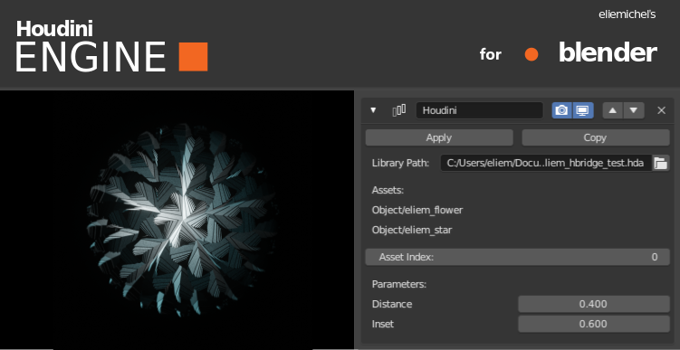
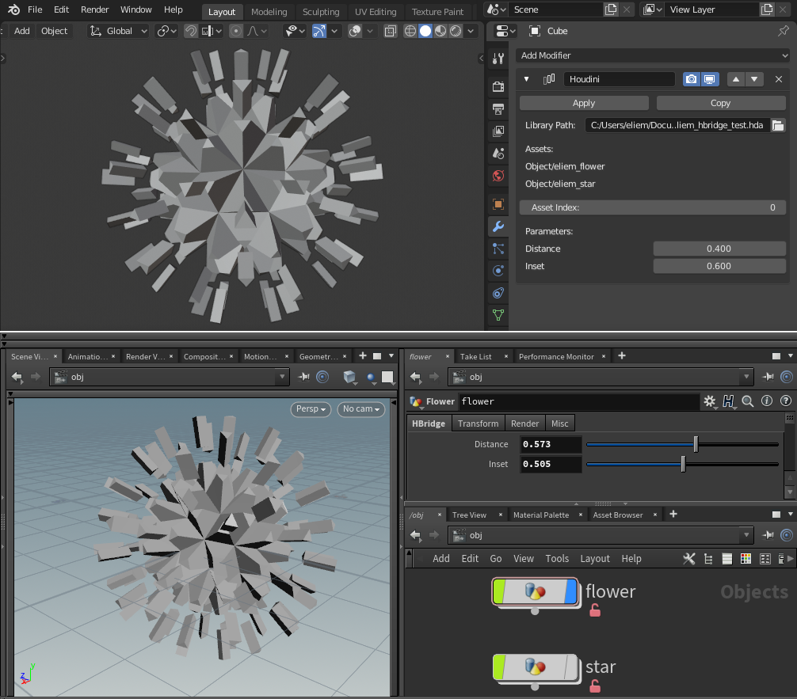

Houdini Engine for Blender
==========================

This is an edited version of Blender 2.80 beta including a Houdini Engine based modifier.

This modifier lets you use virtually any procedural object or processing created in Houdini as a Blender modifier, enabling truly fluent Blender-Houdini workflows.

## In order to comply with the terms of Blender's license, this repository has been split into two parts, and its commit history wiped out

The houdini engine integration to Blender requires the following two elements:

 - A version of Blender with support for [OpenMeshEffect](https://github.com/eliemichel/OpenMeshEffect), available here: [OpenMeshEffectForBlender](https://github.com/eliemichel/OpenMeshEffectForBlender)

 - The Houdini Engine OpenMeshEffect plugin, available here: [MfxHoudini](https://github.com/eliemichel/MfxHoudini)

## Building

### Binaries

Instructions for building *OpenMeshEffect for Blender* and the *Houdini Engine OpenMeshEffect plugin* are available in their respective projects.

## Running

You must ensure that your Houdini binary directory is included in your path before running this version of Blender, otherwise it will complain about missing DLLs (libHAPI.dll, tbb.dll, etc.). To do so, adapt the following line to your case:

	# On windows
	set PATH=%PATH%;E:/Program Files/Side Effects Software/Houdini 17.5.293/bin

	# On linux
	export LD_LIBRARY_PATH=$LD_LIBRARY_PATH:/opt/hfs17.5.293/dsolib

## Usage

Before using the modifier in Blender, you need to create an asset library in Houdini. You can find instructions about this in the [Houdini Documentation](https://www.sidefx.com/docs/houdini/assets/create.html), but basically right click on a node and "Create digital asset". This will save the digital asset in a houdini library likely called `something.hda`. You can save many different assets in a single HDA file.

To build your Houdini based OpenMeshEffect plugin, start from the default Houdini plugin and replace in the bundle the `library.hda` file with your own Houdini Digital Asset library (you must call it `library.hda` as well).

Once you have this, you can go to blender, create an object and add an OpenMeshEffect modifier to it. In the plugin path, provide the bundle previously created, like `/path/to/something.ofx.bundle`. This will open the library and list the available assets.

Then set the Asset index to the asset in the library you are interested in. A value of -1 deactivates the modifier, then 0 will use the first asset, 1 the second, and so on. With a valid asset selected, some parameters will appear. To prevent the UI from being flooded, **only parameters whose name starts with `hbridge_` are displayed**.

**NB** At the moment, only float parameters are supported.

You can then stack it with other modifiers, and/or apply it. Currently, it generate only triangles, but it will soon support ngons.

Example of use: https://twitter.com/exppad/status/1146738862456266752

## Houdini License

This patch requires a valid Houdini Engine license at runtime. It is the same licensed used for *Houdini Engine for Unity*, *Houdini Engine for Unreal* and the likes. It can be downloaded for free if you are already in possession of an Indie License, or must be purchased separately for other types of licenses. See the [Houdini online store](https://www.sidefx.com/buy) for more information.

**Unfortunately, the Houdini Engine is not available with the free Houdini Apprentice edition.**
